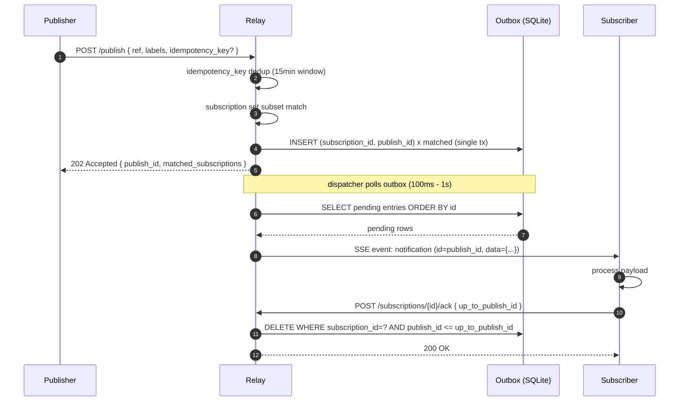
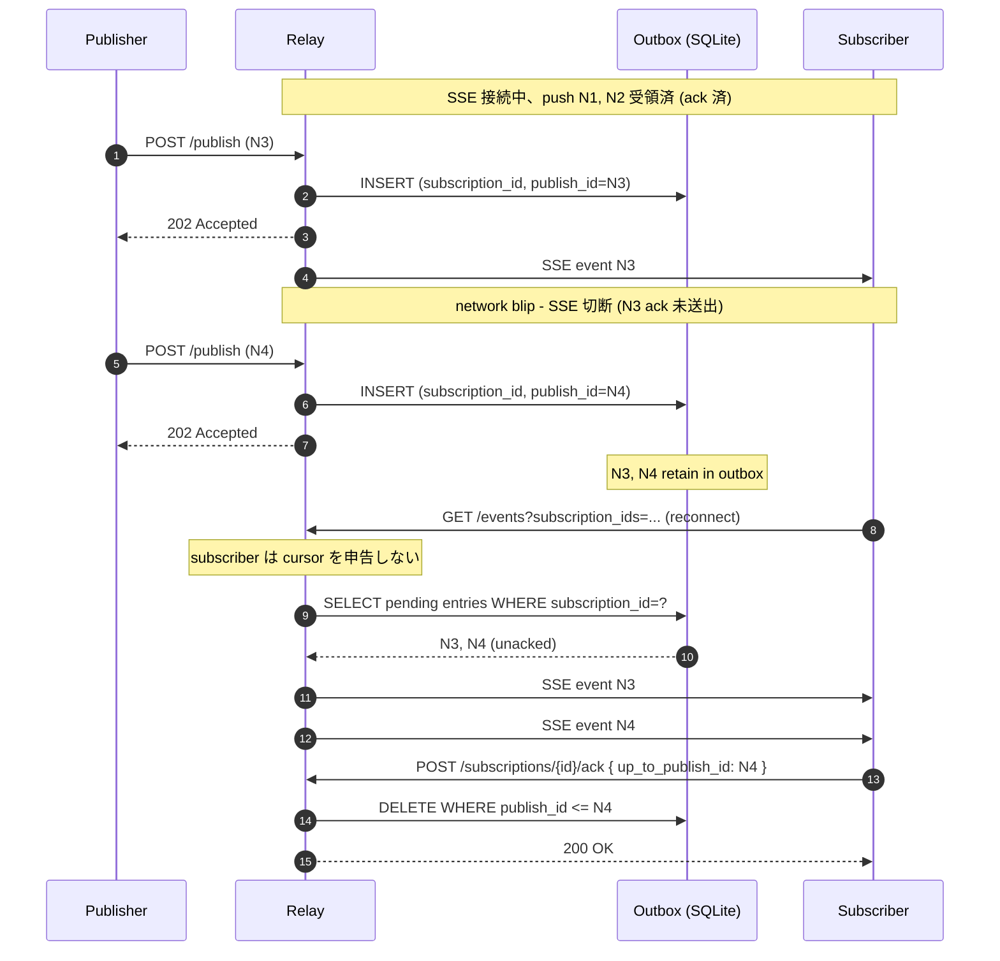
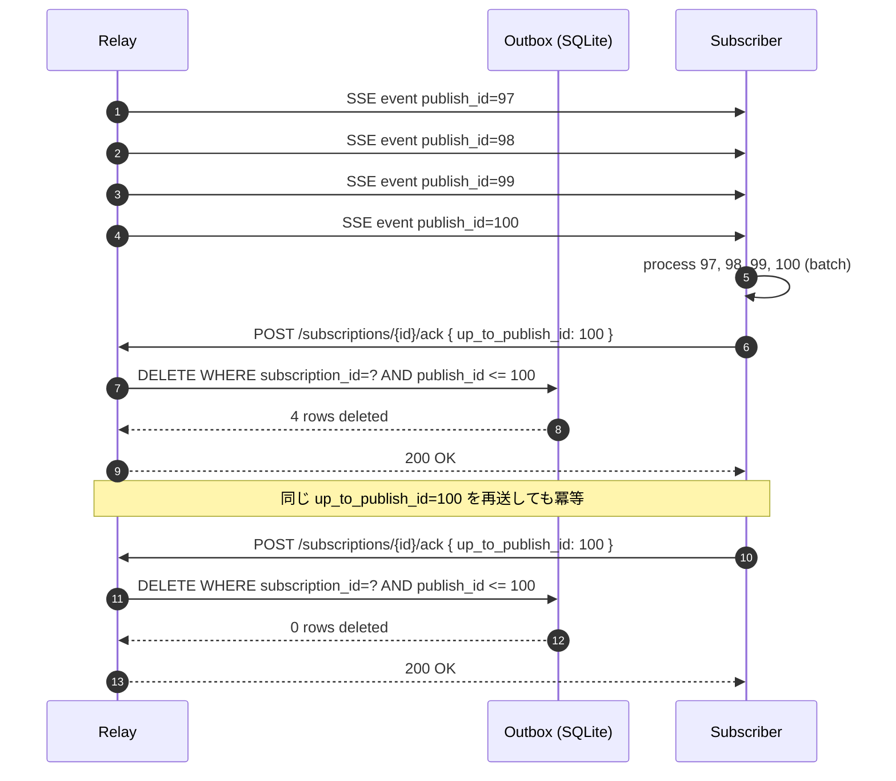
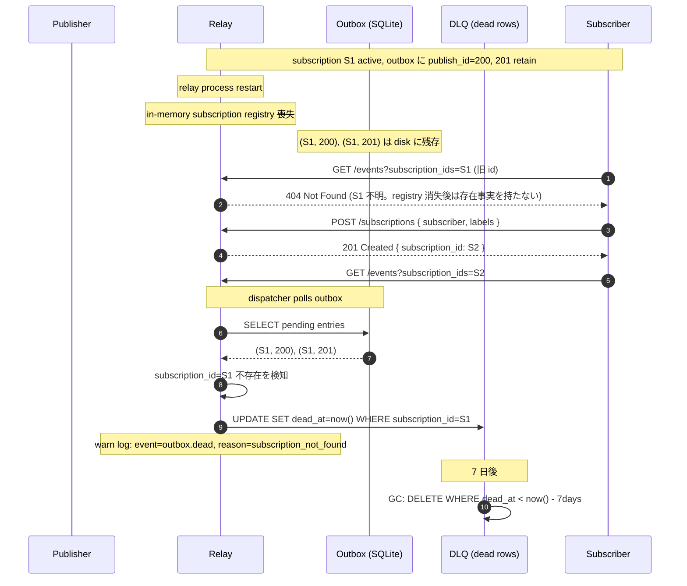
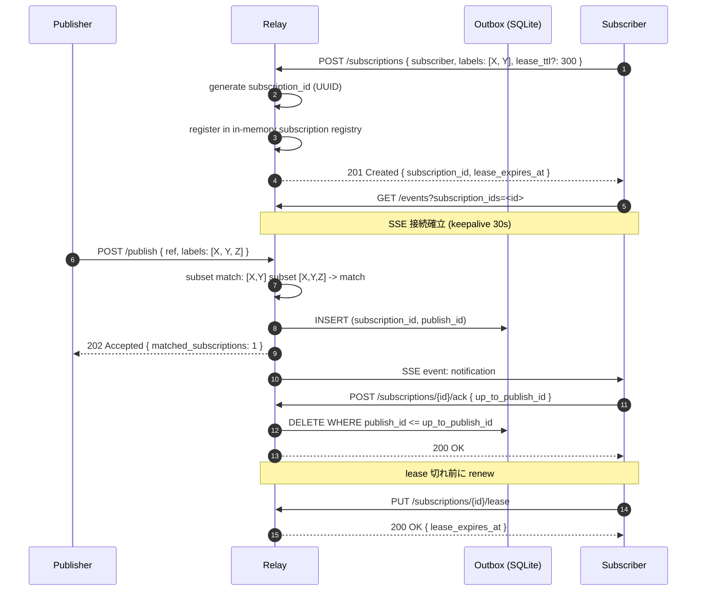
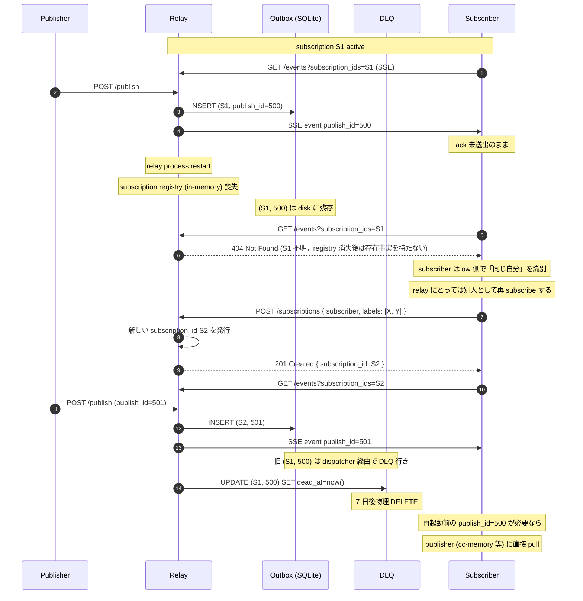

# relay v2 主要フロー シーケンス図

本書は relay v2 の主要フローを mermaid sequenceDiagram で可視化したものである。relay v2 の機能要件文書および ow ↔ relay 責務境界 decision を一次リソースとし、外部実装者が「いつ何がどのコンポーネントを通るのか」を一覧できる粒度で描く。

用語は暫定的に機能要件文書の v2 物理改稿版にそろえる（relay v2 のユビキタス言語は議論継続中）。「場」と「stream」が併存する箇所は本書では原則「stream」を使う。`subscription` / `subscriber` / `publisher` / `outbox` / `ack` / `DLQ` / `labels` はそのまま英語表記とする。

参加者は以下に統一する。

- **Publisher**: subscription レーンに `POST /publish` を投げる側、または stream レーンに `POST /streams/{id}/messages` を投げる側
- **Relay**: relay 本体（HTTP API + dispatcher）
- **Outbox**: relay 内部の永続キュー（SQLite。relay の disk 永続はこの 1 本のみ）
- **Subscriber**: subscription をひとつ以上持ち SSE で push を受ける側

至るところで「at-least-once」「cumulative ack」「subscriber 履歴中立性」が効くので、各図の説明文でも触れる。

---

## 1. publish → outbox INSERT → SSE push（happy path）

最も基本となる subscription レーンのハッピーパスである。publisher が `POST /publish` を投げると、relay は subscription マッチングと outbox INSERT を **同一 transaction** で済ませてから `202 Accepted` を返す。202 が返った時点で「publish は relay の outbox に永続化済み」が保証されるため、以降 relay が再起動しても当該 publish は失われない（at-least-once の起点）。

push の TCP write 完了は ack ではない。subscriber が処理を終えてから `POST /subscriptions/{id}/ack { up_to_publish_id }` を返し、relay は cumulative ack で対応 outbox エントリを削除する。subscriber プロセスが SSE 受信後に crash しても ack を返さないため outbox が残り、再接続時に黙って再 push される（at-least-once の保証点）。

---

## 2. SSE 再接続 resume（subscriber 切断 → 再接続）

subscriber が SSE 接続を一時的に失った場合のフローである。relay は subscriber 側のカーソル申告（`Last-Event-ID` や `history?since=N`）に頼らず、**relay 側の per-subscription outbox 状態がカーソルそのもの** という設計をとる。subscriber は再接続時に何もカーソルを送らず、relay は ack されていない outbox エントリを黙って再 push する。

これは subscriber の実装コストを最小化する設計上の到達点である。subscriber は publish_id のギャップ検知ロジックを持つ必要がなく、relay が「outbox に残っているものを順に流し直す」だけで取りこぼしが構造的に回収される。retain 期間（default 24 時間）を超えたエントリは DLQ 経路で消えるため、それより古い取りこぼしは publisher への直接 pull にフォールバックする責務分担になる。

---

## 3. cumulative ack

ack は個別ではなく **cumulative**（累積）である。subscriber は受信した最後の publish_id を `up_to_publish_id` として送るだけで、relay 側は当該 subscription の outbox から `publish_id <= up_to_publish_id` をまとめて削除する。

これにより subscriber 側の ack コストが O(1) になり、push の頻度が高い場合でも ack 往復が線形に増えない。同じ `up_to_publish_id` を 2 回送っても冪等で `200 OK` が返るため、subscriber は ack の再送ガードを軽く保てる。subscriber は受信順に処理しても、batch 処理してから最大値だけ ack してもよい（処理単位の取り方は subscriber 側ポリシー）。

---

## 4. DLQ 経路（permanent error）

relay 再起動を跨いだ場合、subscription registry が in-memory なので消失する（relay の disk 永続は outbox のみ）。再起動前の subscription_id 宛に残っていた outbox エントリは「subscription_id 不存在」状態となり、dispatcher は当該エントリを **DLQ 経路** に倒す（`dead_at` をセットして polling 対象から外す）。dead エントリは 7 日後に物理 DELETE される。

DLQ 入りは relay 再起動以外にも発生する。push retry が累積上限（3.1 秒）に達した後 retain 期間内に再接続なし、retain 期間（default 24h）超過、subscriber identity 削除済み、lease 切れによる自然消滅、いずれも同じ DLQ 経路を通る。明示 unsubscribe だけは DLQ を通らず、未 ack エントリは unsubscribe と同一 transaction で即時削除される（意図的な関心放棄は事故ではないため、DLQ と warn ログは意図しない消滅の観測専用に保つ）。subscriber は新しい subscription_id で再 subscribe するため、旧 subscription_id 宛の dead エントリは新経路で再配達されない。

この設計は「subscriber 履歴中立性」の必然的な帰結である。relay は旧 subscription_id と新 subscription_id を結びつける ledger を持たないため、relay 再起動を跨いだ取りこぼしの回収は publisher 直接 pull に責務分離される。

---

## 5. subscribe（subscription 作成）

subscriber が新規に関心ラベルを宣言する起点である。`POST /subscriptions` で `subscriber identity` と `labels` を渡すと、relay は新しい `subscription_id`（UUID）を発行して返す。**subscription_id は relay 側で採番する。subscriber が持参する経路はない**（subscriber 履歴中立性の structural enforcement）。

subscribe が成功した瞬間から、当該 subscription は publish マッチング対象に含まれる。マッチング条件は「subscribe.labels が publish.labels の subset であればマッチ」（AND セマンティクス）である。SSE 接続は `GET /events?subscription_ids=...` で開始し、1 接続に複数 subscription_id を多重化できる。

lease TTL は min 30 秒 / max 1 日 / default 5 分（subscriber 種別中立性のため固定）。renew しないまま lease 切れすると subscription は失効し、以降の publish は当該 subscription にマッチしなくなる。

---

## 6. relay 再起動と subscriber 別人扱い

「subscriber 履歴中立性」の最も特徴的な帰結である。relay は subscription_id を **その瞬間の識別子** としてのみ持ち、再起動前後の subscription_id を結びつけない。subscriber 側がアプリ層で同じ実体だと判断しても、relay にとっては別 entity として扱われる。

旧 subscription_id 宛に残った outbox エントリは DLQ 経路で自然掃除される（フロー 4 参照）。subscriber 側の経時同一性管理は relay の責務外であり、ow / publisher 側ポリシーで担保する設計になっている（責務境界 decision を参照）。

この図は relay 再起動を境にして「同じ subscriber が relay 側では別人として再登録される」ことと、それでも outbox の自然掃除でゴミが残らないことを並べて示す。

---

## 補足

### outbox に関する不変条件

- outbox エントリのキーは `(subscription_id, publish_id)`
- `publish_id` は relay 全体で global に単調増加する（stream 内 seq / subscription 内 seq は存在しない）
- relay が disk で持つ永続データは outbox のみ。subscription registry / lease / presence / stream membership は in-memory に置く

### at-least-once が効くポイント

| ポイント | 仕組み |
|---|---|
| publish 受領 → outbox INSERT | 同一 transaction で fan-out。202 が返れば outbox 永続化済み |
| push 失敗 → 指数バックオフ retry | 累積 3.1 秒まで（初回 100ms、係数 2、5 回） |
| SSE 切断 → outbox に retain | retain 期間 default 24h、subscriber 再接続時に黙って再 push |
| TCP write 完了 ≠ ack | subscriber 発の application-level ack を待たないと outbox は消えない |
| 同一 publish が複数回届く可能性 | subscriber 側で `(subscription_id, publish_id)` で重複排除（idempotent consumer） |

### relay が「やらないこと」

- subscriber 識別の経時的同一性管理（再接続 = 新規 subscriber）
- 場（stream）のメッセージ永続化（pass-through）
- semantic authZ（特定 labels への subscribe 可否、close / cancel 可否などの意味判定）
- retain 切れ以降の取りこぼし回収（publisher 直接 pull が source of truth）
